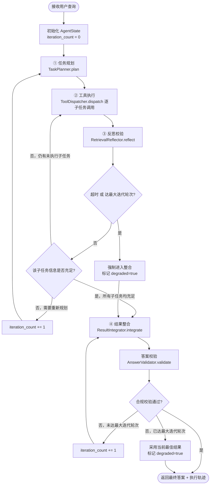
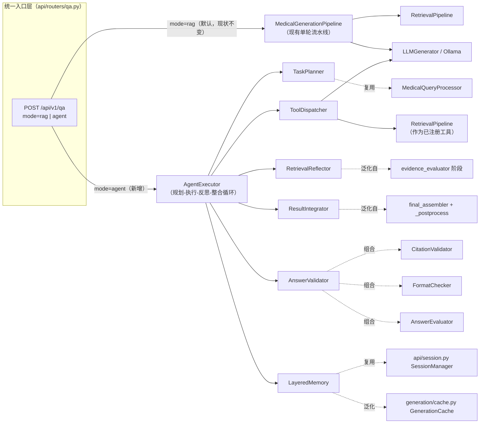

# Agentic RAG 架构设计

本文档是"架构设计与工具抽象"阶段的交付物：顶层架构设计与核心组件边界定义。**只定义结构与契约，不含执行逻辑实现**——对应的类型定义与接口代码在 [`agent/`](agent/)（`state.py` + `interfaces.py`），均可直接导入、已通过基本验证，但方法体均为占位（`Protocol` 契约），真正的 `AgentExecutor` 编排逻辑是下一阶段的实现工作。

现有系统（[`retrieval/`](retrieval/) + [`generation/`](generation/) + [`api/`](api/)）已经是一条工作良好的**单轮 RAG 流水线**：检索 → 证据评估 → 答案生成 → 批判性审查 → 最终组装，全部在一次调用内线性走完。本次设计要解决的问题是：面对需要**多跳检索、动态调整检索策略、组合多种"工具"**的复杂医学问题（现有流水线检索一次就直接生成，无法"发现证据不够就再查一轮"），如何在不推倒重来的前提下，加一层 **Agent 编排**，把现有能力重新组织成可迭代的 规划 → 执行 → 反思 → 整合 闭环。

---

## 1. 整体架构方案设计

### 1.1 全局状态（State）数据结构

完整定义见 [`agent/state.py`](agent/state.py)，核心是 `AgentState`：

```python
@dataclass
class AgentState:
    # 输入与元信息
    query: str
    session_id: str | None
    language: str
    created_at: float

    # 规划
    subtasks: list[SubTask]

    # 执行
    tool_call_history: list[ToolCall]
    retrieval_results: list[RetrievalResultRef]

    # 推理
    intermediate_conclusions: list[str]

    # 反思
    reflections: list[ReflectionRecord]

    # 校验
    compliance_check: ComplianceCheckResult | None

    # 输出
    final_answer: str | None
    sources: list[dict]

    # 控制（兜底机制）
    status: AgentStatus
    iteration_count: int
    max_iterations: int
    timeout_seconds: float
    error: str | None
```

设计要点：

- **`retrieval_results` 只存轻量引用**（`tool_call_id` + 统计量），不内联完整 chunk 内容——完整数据留在 `tool_call_history` 对应记录里，避免 State 随迭代轮次线性膨胀到无法序列化/落日志。
- **`reflections` 是列表而非单值**：同一个子任务可能被反思多次（第一轮"证据不足"→补充检索→第二轮"证据充分"），需要保留完整历史而不是只保留最后一次判断。
- **`sources` 字段结构直接复用**现有 `generation.pipeline._format_sources()` / `api/models.py` 里 `SourceItem` 的字段（`rank`/`chunk_id`/`journal`/`pub_year`/`pmc_id`/`relevance_score`），保证 Agent 模式和 RAG 模式的溯源信息格式一致，下游（前端/日志）不用区分两套 schema。
- 子结构 `SubTask` / `ToolCall` / `ReflectionRecord` / `ComplianceCheckResult` 各自独立成 dataclass（而不是把所有字段拍平进 `AgentState`），原因：这些是"会反复追加的列表元素"，独立定义能让每次 `append` 是类型安全的构造调用，而不是拼手写 dict。

### 1.2 执行流程闭环设计



四个环节的输入/输出/终止条件：

| 环节 | 输入 | 输出 | 何时进入下一环节 |
|---|---|---|---|
| ① 任务规划 | `state.query` + `state.reflections`（若非首轮） | 新增/修订 `state.subtasks` | 规划器返回后无条件进入执行 |
| ② 工具执行 | 待执行 `SubTask` 列表 | 追加 `state.tool_call_history` / `state.retrieval_results` | 该批子任务全部执行完（成功或失败均记录）后进入反思 |
| ③ 反思校验 | 子任务 + 相关 `ToolCall` | 追加一条 `ReflectionRecord` | 全部子任务 `sufficiency == "sufficient"` → 整合；否则按 1.3 的分支规则回到 ② 或 ① |
| ④ 结果整合 + 校验 | 全部 `intermediate_conclusions` + `tool_call_history` | `final_answer` + `sources`，随后 `compliance_check` | 校验通过 → 结束；不通过且未超限 → 重新整合；已超限 → 降级返回 |

### 1.3 状态流转规则

| 当前状态 | 判断条件 | 下一状态 | 说明 |
|---|---|---|---|
| `PLANNING` | 规划器返回子任务列表 | `EXECUTING` | 无条件流转，规划器本身不判断"够不够"，那是反思器的职责 |
| `EXECUTING` | 本批子任务全部执行完毕 | `REFLECTING` | 单个工具失败不阻塞其它子任务（工具调度器内部重试耗尽后记 `success=False` 继续） |
| `REFLECTING` | `should_terminate()` 为真（超时/达迭代上限） | `INTEGRATING`（强制，`degraded=true`） | 兜底优先于"是否充分"的判断 |
| `REFLECTING` | 未终止 + 存在 `sufficiency="insufficient"` 的子任务 + 仍有未执行的候选工具/查询改写方向 | `EXECUTING` | 同一迭代轮次内补充执行，不消耗 `iteration_count` |
| `REFLECTING` | 未终止 + 存在 `sufficiency="insufficient"` 但现有工具/改写方向已穷尽 | `PLANNING`（`iteration_count += 1`） | 需要重新规划（如换一批子任务/换检索策略），消耗一次迭代 |
| `REFLECTING` | 未终止 + 全部子任务 `sufficiency="sufficient"` | `INTEGRATING` | 正常路径 |
| `INTEGRATING` → `VALIDATING` | 整合器产出 `final_answer` | 无条件流转 | — |
| `VALIDATING` | 校验通过 | `DONE` | — |
| `VALIDATING` | 校验不通过 + 未达 `max_iterations` | `INTEGRATING`（`iteration_count += 1`） | 带着 `compliance_check.revision_instructions` 重新整合，语义上对应现有 `generation` 层 `critical_reviewer → final_assembler` 的重写循环 |
| `VALIDATING` | 校验不通过 + 已达 `max_iterations` | `DONE`（`degraded=true`） | 采用当前最佳结果而不是无限重试 |
| 任意状态 | 工具/LLM 调用抛出未捕获异常 | `FAILED` | 整个 Agent 调用失败，向上抛出，由 API 层统一异常处理（复用现有 `api/exceptions.py`） |

### 1.4 兜底机制（避免无限循环）

- **`max_iterations`**（默认 5）：规划-执行-反思大循环 与 整合-校验小循环 共享同一个 `iteration_count` 计数器，避免"规划循环不超限但校验循环无限重试"这种绕过兜底的漏洞。
- **`timeout_seconds`**（默认 90s，覆盖从 `AgentState.created_at` 到最终返回的整个调用）：每次进入 `REFLECTING` 前调用 `state.should_terminate()` 检查，一旦超时立即强制整合，不等当前迭代跑完。
- **单个工具调用的重试**由 `ToolDispatcher.dispatch()` 内部处理（注册时配置 `max_retries`，如检索工具网络抖动重试 2 次），与上面两个"宏观"兜底是两层不同粒度的保护——工具级重试解决"临时抖动"，宏观兜底解决"任务本身就很难/模型持续给出不合规结果"。
- 触发任一兜底机制的结果都会标记 **`degraded=true`**（体现在响应的 `execution_trace` 里，见 2.2 节），调用方可以据此判断"这是尽力而为的结果还是完全达标的结果"，而不是两种情况返回一样的响应让调用方误判质量。

---

## 2. 核心组件定义与接口规范

完整接口代码见 [`agent/interfaces.py`](agent/interfaces.py)（`typing.Protocol`，运行时可用 `isinstance()` 做结构化类型检查，已验证）。

### 2.1 组件职责与复用关系

| 组件 | 职责 | 输入 → 输出 | 复用/包装的现有代码 |
|---|---|---|---|
| **TaskPlanner**<br/>医学任务规划器 | 把用户查询拆解为结构化子任务 + 优先级 | `AgentState`（含 query/历史 reflections）→ `list[SubTask]` | 调用 `retrieval.query_processor.MedicalQueryProcessor` 做实体识别/缩写展开/过滤条件提取，作为拆分子任务的信号来源 |
| **ToolDispatcher**<br/>工具调度器 | 工具注册、参数校验、调用执行、异常重试 | 工具名 + 参数 → `ToolCall`（含结果/成功状态） | 把 `retrieval.pipeline.RetrievalPipeline.retrieve()` 包装成第一个注册工具（见 2.2 节示例）；未来新工具用同样方式接入 |
| **LayeredMemory**<br/>分层记忆模块 | 会话记忆 + 工具结果缓存 | session_id → 上下文前缀；(tool_name, args) → 缓存结果 | 会话层直接是 `api.session.SessionManager`；缓存层泛化 `generation.cache.GenerationCache`（键从 prompt 泛化为 tool_name+args） |
| **RetrievalReflector**<br/>检索反思器 | 判断某子任务的检索结果是否充分，给出补检索建议 | `SubTask` + 相关 `ToolCall` 列表 → `ReflectionRecord` | 现有 `generation.prompt_templates` 里 `evidence_evaluator` 阶段的多轮泛化版——同样的"判断相关性/充分性"逻辑，扩展到支持多轮迭代 |
| **AnswerValidator**<br/>答案校验器 | 生成答案的合规性校验 + 修正意见 | 答案文本 + `AgentState` → `ComplianceCheckResult` | 直接组合 `CitationValidator`（引用有效性）+ `FormatChecker`（格式规范）+ `AnswerEvaluator.evaluate_hallucination_risk`（幻觉信号），三者结果映射为 `ComplianceCheckResult` 的三个字段 |
| **ResultIntegrator**<br/>结果整合器 | 汇总多轮结论，产出最终答案 + 溯源信息 | `AgentState`（intermediate_conclusions + tool_call_history）→ `(final_answer, sources)` | 现有 `final_assembler` 提示词阶段 + `_postprocess()` 引用格式化逻辑的泛化版——输入从"单一 draft_answer"扩展为"多子任务累积的结论" |

### 2.2 工具抽象示例（本任务的核心设计点）

现状：检索是 `MedicalGenerationPipeline.generate()` 里硬编码的第 1 步。设计后：检索是**注册进 `ToolDispatcher` 的一个工具**，Agent 核心循环只认"工具名 + 参数 schema + 调用结果"，不关心工具内部是本地向量检索还是别的什么：

```python
# 设计示意（未来实现参考，非本次交付代码）
from pydantic import BaseModel

class RetrievalToolParams(BaseModel):
    query: str
    top_k: int = 8
    fusion_strategy: str = "rrf"

def retrieval_tool_handler(params: RetrievalToolParams) -> dict:
    return retrieval_pipeline.retrieve(
        params.query, top_k=params.top_k, fusion_strategy=params.fusion_strategy,
    )

dispatcher.register_tool("retrieval", retrieval_tool_handler, RetrievalToolParams, max_retries=2)
```

这个抽象打开的口子：未来加"药物相互作用查询""单位换算""面向 PubMed 的实时检索"等工具，只需要各自写一个 `handler` + `param_schema` 注册进去，`TaskPlanner`/`ToolDispatcher`/Agent 主循环都不需要改动。

### 2.3 组件依赖关系图



图中"泛化自/组合/复用"的连线是关键：六个新组件里，**没有一个是从零实现的**——都是对现有 `retrieval`/`generation`/`api` 模块的重新编排或轻量封装。

---

## 3. 双模式兼容架构设计

### 3.1 统一入口层

`POST /api/v1/qa`（现有端点，见 `api/routers/qa.py`）新增一个可选字段路由执行链路，**默认值保证现状零改动**：

```python
# 设计示意：QARequest 新增字段（现有字段全部不变）
class QARequest(BaseModel):
    query: str = Field(..., min_length=1, max_length=2000)
    top_k: int = Field(default=8, ge=1, le=20)
    fusion_strategy: Literal["rrf", "weighted", "simple"] = "rrf"
    session_id: str | None = None
    run_evaluation: bool = True
    run_review: bool = True
    mode: Literal["rag", "agent"] = "rag"          # 新增，默认 rag——不传这个字段的现有调用方行为完全不变
    max_iterations: int = Field(default=5, ge=1, le=10)   # 仅 agent 模式生效
    timeout_seconds: float = Field(default=90.0, ge=10, le=300)  # 仅 agent 模式生效
```

路由逻辑（`ask()` handler 内部）：

```python
if req.mode == "agent":
    state = AgentState.new(req.query, session_id=req.session_id,
                            max_iterations=req.max_iterations, timeout_seconds=req.timeout_seconds)
    result = agent_executor.run(state)      # 新增执行路径
else:
    result = pipeline.generate(req.query, top_k=req.top_k, ...)   # 现有路径，完全不变
```

`mode="rag"` 分支就是现有代码，一行都不用改；`mode="agent"` 是纯新增分支。两条链路在同一个 handler 里分叉，之后统一走同一个响应组装/日志/异常处理流程。

### 3.2 统一响应结构

`QAResponseData`（现有模型）新增**仅 agent 模式才填充**的可选字段，RAG 模式下这些字段保持 `None`/缺省，不破坏现有调用方对响应结构的假设：

```python
class QAResponseData(BaseModel):
    # 以下为现有字段，两种模式都会填充
    answer: str
    sources: list[SourceItem]
    session_id: str | None = None
    total_time_seconds: float
    citation_retry_attempts: int
    format_check_pass: bool

    # 以下为新增字段，仅 mode="agent" 时非 None
    execution_trace: AgentExecutionTrace | None = None


class AgentExecutionTrace(BaseModel):
    iteration_count: int
    subtasks: list[SubTaskSummary]      # 每个子任务的 description/status/assigned_tool
    tool_calls: list[ToolCallSummary]   # 每次调用的 tool_name/success/elapsed_seconds
    reflections: list[ReflectionSummary]
    degraded: bool                      # 是否触发了 1.4 节的兜底机制而非正常完成
```

`execution_trace` 的子结构复用 `agent/state.py` 里已定义的 `SubTask`/`ToolCall`/`ReflectionRecord`（做字段裁剪，不下发内部调试信息如完整 `arguments`/`result`，只下发前端/调用方关心的摘要字段）。

### 3.3 复用现有日志 / 监控 / 缓存体系

不引入新的基础设施，全部接到已有的：

| 能力 | 现有实现 | Agent 模式怎么接入 |
|---|---|---|
| 结构化日志 | `MedicalGenerationPipeline._log_run()` 的 JSONL 追加写模式（`logs/*.jsonl`） | 新增 `logs/agent_execution.jsonl`，沿用完全相同的"每次调用一行 JSON"约定，字段换成 `AgentExecutionTrace` 的摘要 |
| 请求级日志 | `api/middleware.py` 的 `RequestLoggingMiddleware`（request_id/path/status/耗时） | 不变——中间件在 HTTP 层工作，不区分 `mode`，两种模式的请求都会被记录 |
| 运营统计 | `api/stats.py` 的 `StatsTracker`（调用次数/成功率/平均耗时） | `record()` 调用方式不变；`snapshot()` 返回结构新增可选的 `avg_iterations`/`tool_call_success_rate` 字段（agent 模式调用产生数据后才非零，向后兼容） |
| 组件健康检查 | `api/health_checker.py` 的 `HealthChecker`（llm/vector_store/database） | 新增一项 `tool_registry`（已注册工具数 + 各工具最近调用成功率），复用同样的 `{name, status, detail, latency_seconds}` 结构 |
| 结果缓存 | `generation/cache.py` 的 `GenerationCache`（LRU+TTL+温度门控） | `LayeredMemory` 的工具结果缓存层直接实例化一个 `GenerationCache`，把"温度门控"泛化成"该工具是否声明为确定性工具"（如检索结果在语料不变的前提下是确定性的，适合缓存；带随机性的工具则不缓存） |
| 会话管理 | `api/session.py` 的 `SessionManager` | `LayeredMemory.get_session_context()` 直接调用其 `build_context_prefix()`，不重新实现 |

这样设计的好处：Agent 模式上线后，现有的运维习惯（看 `logs/*.jsonl` 排查问题、看 `/api/v1/stats` 监控大盘、`/health` 探活）**不需要学一套新工具**，只是多了几个字段/一个新日志文件。

---

## 4. 交付物清单对照

| 任务书要求的交付物 | 对应位置 |
|---|---|
| Agent 核心架构流程图 | 本文档 §1.2 |
| 全局 State 数据结构定义 | 本文档 §1.1 + [`agent/state.py`](agent/state.py)（可直接导入运行） |
| 状态流转规则说明 | 本文档 §1.3、§1.4 |
| 核心组件接口定义文档 | 本文档 §2.1、§2.2 + [`agent/interfaces.py`](agent/interfaces.py)（`Protocol`，可 `isinstance()` 检查） |
| 组件依赖关系图 | 本文档 §2.3 |
| 双模式兼容架构设计 | 本文档 §3.1 |
| 统一响应结构定义 | 本文档 §3.2 |
| 入口层路由方案 | 本文档 §3.1 |

## 5. 明确不在本次范围内的工作

- `AgentExecutor` 的实际编排逻辑（真正跑起来的规划-执行-反思-整合循环）
- `TaskPlanner`/`RetrievalReflector`/`AnswerValidator`/`ResultIntegrator` 的具体提示词与 LLM 调用实现
- `api/models.py`/`api/routers/qa.py` 的实际代码改动（3.1/3.2 节的代码都是设计示意，尚未写入现有源文件）
- 新工具（除检索外）的具体接入

这些属于"Agent 核心开发"阶段的实现工作，本次只交付边界清晰、可直接被下一阶段导入使用的类型定义与接口契约。
